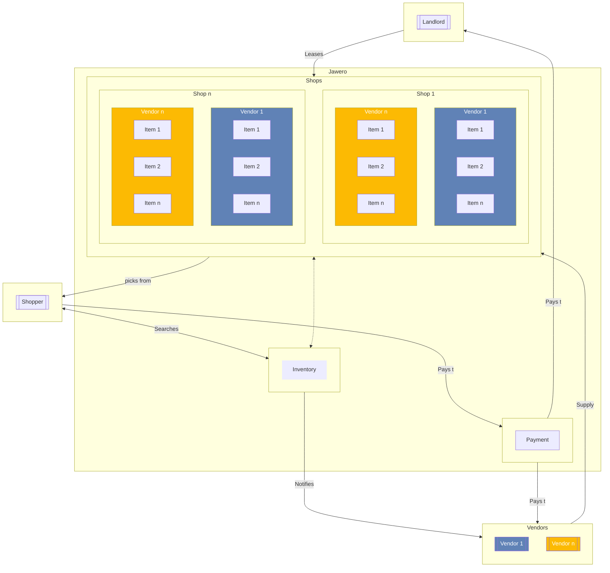

Welcome to Jawero, where innovation meets convenience in the world of shopping. At Jawero, we're redefining the shopping experience, empowering both buyers and sellers with a groundbreaking concept that transforms the way we buy and sell goods.

Our platform and tools turn any traditional physical shop of any size into a multivendor self-checkout shop. This removes from the seller the hassle of getting a physical store, reduces the time to market for the seller as well as eliminating several barriers to entry. With the self-checkout feature, the store can remain operational all night. Enhanced by our self-checkout feature, stores can now stay operational around the clock, ensuring uninterrupted convenience for all.

